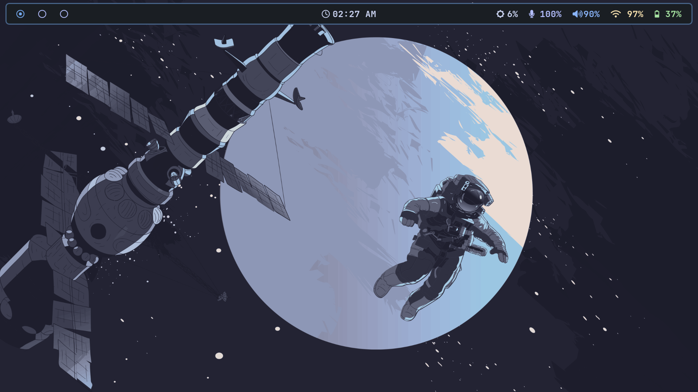

<div align="center">

## dotfiles
*<code>A minimal, efficient setup focused on productivity and aesthetics</code>*
|  [](LICENSE) [](https://github.com/Srinath10X/dotfiles/stargazers) [](https://github.com/Srinath10X/dotfiles/commits/main) [](https://github.com/Srinath10X/dotfiles/issues) |
|-----------|



</div>

---

## Table of Contents

- [Overview](#overview)
<!-- - [Showcase](#showcase) -->
- [Installation](#installation)
  - [Prerequisites](#prerequisites)
  - [Quick Install](#quick-install)
  - [Manual Installation](#manual-installation)
- [Configuration](#configuration)
- [Keybindings](#keybindings)
- [Contributing](#contributing)
- [Contributors](#contributors)
  
---

## Overview

This repository contains my personal Arch Linux configuration files, featuring a Wayland-based desktop environment with Hyprland as the compositor. The setup prioritizes performance, minimalism, and a cohesive visual experience.

### Core Components

| Component | Software |
|-----------|----------|
| **Operating System** | Arch Linux |
| **Window Manager** | Hyprland |
| **Terminal Emulator** | Kitty, Alacritty |
| **Shell** | Zsh |
| **Status Bar** | Waybar |
| **Application Launcher** | Wofi |
| **Text Editor** | Neovim |
| **File Manager** | lf (terminal-based) |
| **Lock Screen** | Swaylock |
| **PDF Viewer** | Zathura |
| **Audio Visualizer** | Cava |
| **Terminal Multiplexer** | Tmux |

---

<!-- !! ADD THIS TABLE WHEN YOU HAVE "TERMINAL SETUP" IMAGE !!
## Showcase
| Desktop Environment | Terminal Setup |
|:-------------------:|:--------------:|
|  | *Coming soon* (add path ./assets/captures/terminal.png) |
-->

</div>

<details>
<summary>Wallpapers:</summary>

| Anime | Catppuccin |
|:-------------------:|:--------------:|
|  |  |
|  |  |
|  |  |
|  |

</details>

---

## Installation

### Prerequisites

Ensure you have the following installed:

```bash
# core system.
base base-devel linux linux-firmware
# <---------------->
# essential packages.
hyprland waybar kitty alacritty wofi zsh neovim tmux git
```

**Optional dependencies:**
- `swaylock` - Screen locking
- `zathura` - PDF viewing
- `cava` - Audio visualization
- `lf` - File management

### Quick Install

```bash
git clone https://github.com/Srinath10X/dotfiles.git
cd dotfiles
cp -r config/* ~/.config/
cp .zshrc .zshenv ~/
```

### Manual Installation

<details>
<summary>Detailed step-by-step process</summary>

1. **Clone the repository**
   ```bash
   git clone https://github.com/Srinath10X/dotfiles.git
   cd dotfiles
   ```

2. **Backup existing configurations**
   ```bash
   mkdir -p ~/.config_backup
   cp -r ~/.config/* ~/.config_backup/
   ```

3. **Install configuration files**
   ```bash
   # Copy config directories
   cp -r config/hypr ~/.config/
   cp -r config/kitty ~/.config/
   cp -r config/waybar ~/.config/
   cp -r config/wofi ~/.config/
   # Add other configs as needed
   
   # Copy shell configuration
   cp .zshrc ~/.zshrc
   cp .zshenv ~/.zshenv
   ```

4. **Set Zsh as default shell** (if not already set)
   ```bash
   chsh -s $(which zsh)
   ```

5. **Reload configurations**
   ```bash
   # Reload Hyprland (if running)
   hyprctl reload
   
   # Reload shell
   source ~/.zshrc
   ```

</details>

---

## Configuration

### Hyprland

The Hyprland configuration is located at `config/hypr/hyprland.conf`. Key features include:

- Custom keybindings for efficient workflow
- Window rules and workspace management
- Performance optimizations
- Integration with Waybar and Wofi

### Terminal

Two terminal emulators are configured:
- **Kitty**: Primary terminal with Catppuccin Mocha theme
- **Alacritty**: Alternative lightweight option

Both use Zsh with a minimalist prompt configuration.

### Status Bar

Waybar provides system information and workspace management. Configuration includes:
- Custom styling (`config/waybar/style.css`)
- Module configuration (`config/waybar/config.jsonc`)

---

## Keybindings

Key Hyprland keybindings (see `config/hypr/hyprland.conf` for complete list):

| Keybinding | Action |
|------------|--------|
| `Super + Return` | Launch terminal |
| `Super + D` | Application launcher (Wofi) |
| `Super + Q` | Close focused window |
| `Super + F` | Toggle fullscreen |
| `Super + [1-9]` | Switch to workspace 1-9 |
| `Super + Shift + [1-9]` | Move window to workspace |
| `Super + H/J/K/L` | Focus window (vim-style) |
| `Super + Shift + H/J/K/L` | Move window |
| `Super + L` | Lock screen |

---

## Contributing

Contributions are welcome. If you have improvements or fixes:

1. Fork the repository
2. Create a feature branch (`git checkout -b feature/improvement`)
3. Commit your changes (`git commit -m 'Add improvement'`)
4. Push to the branch (`git push origin feature/improvement`)
5. Open a Pull Request

Please ensure your changes are well-documented and tested.

---

## Contributors

<div align="center">

[](https://github.com/Srinath10X/dotfiles/graphs/contributors)

</div>

Thanks to everyone who has contributed to this project.

<!-- PULLED BY OGKAE -->

---

<div align="center">

**[↑ Back to Top](#dotfiles)**

</div>
