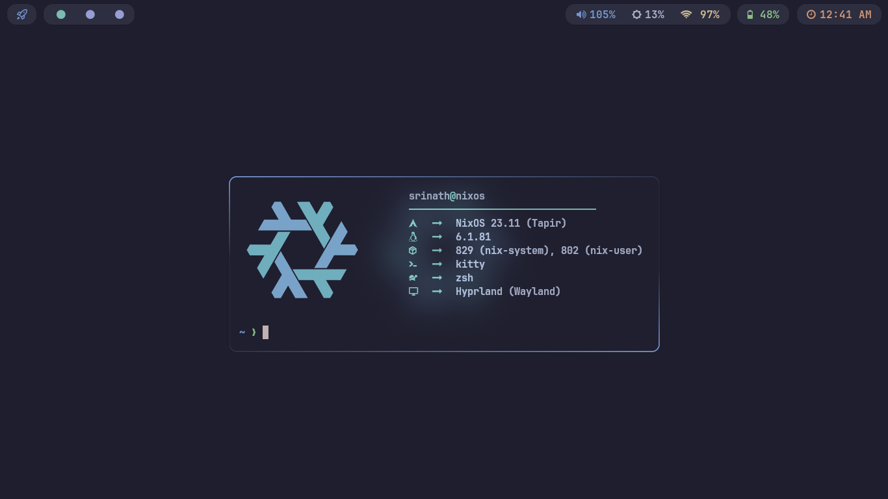
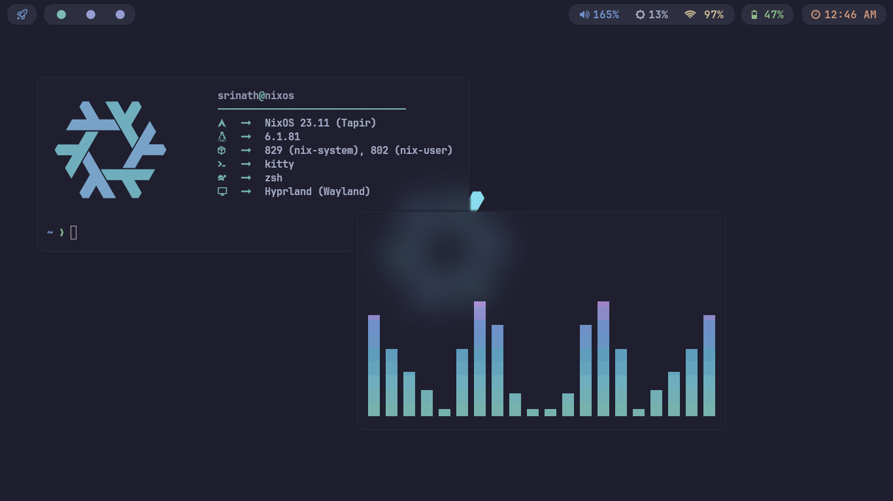

# dotfiles

Arch setup dotfiles: Streamlined for efficiency &amp; aesthetics. Customized configs for a seamless &amp; stylish experience! 🚀🎨

## Showcase




## Table of Contents

- [Overview](#overview)
- [Packages](#packages)
- [Installation](#installation)
- [Contributing](#contributing)
- [License](#license)

## Overview

- **OS** - EndeavourOS
- **Terminal** - Kitty
- **Shell** - Zsh
- **WM** - hyprland
- **Editor** - Neovim

# Packages

You can grab the config files and install packages by hand with this commnad

```
yay -Sy ctpv-git hyprland-bin kitty waybar-hyprland swaybg swaylock-effects wofi mako ttf-jetbrains-mono-nerd noto-fonts-emoji polkit-gnome xdg-desktop-portal-hyprland lxappearance brightnessctl starship
```

# Installation

Just install the packages and copy the config files that works for most of the time with additional dependencies.

1. Clone the repo

```
git clone https://github.com/Srinath10X/dotfiles.git
```

2. Make sure that you have installed all the packages and its dependencies
3. cd to the dotfiles directory

```
cd dotfiles
```

4. Copy the dotfiles into the .config directory

```
cp -r .config/* ~/.config
```

# Note

I have just nuked my previous desktop my current setup is more or less the same. Instead of using p10k I am using p9k as my zsh theme and some extra configurations will be added soon

## Contributing

If you have improvements or additional configurations that might benefit others, I welcome contributions! Please fork the repository, make your changes, and submit a pull request.

## License

This project is licensed under the [GPL](LICENSE.md) - see the [LICENSE.md](LICENSE.md) file for details.
