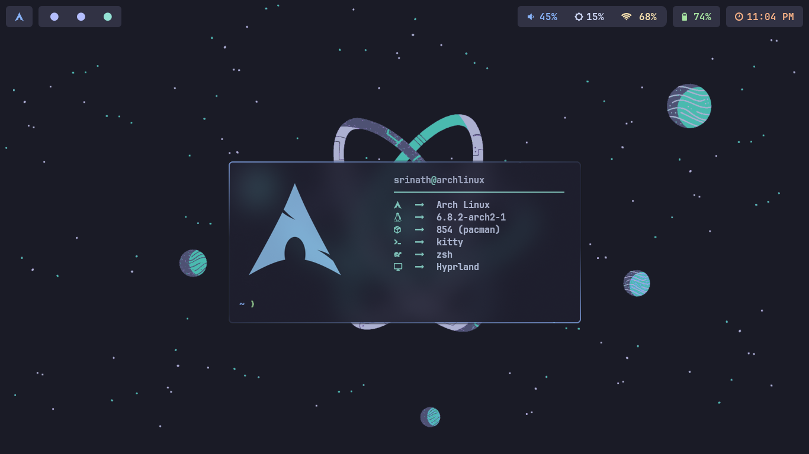
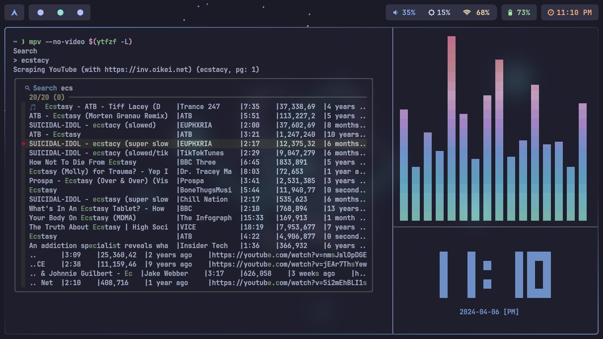

# dotfiles

Arch setup dotfiles: Streamlined for efficiency &amp; aesthetics. Customized configs for a seamless &amp; stylish experience! 🚀🎨

## Showcase





## Table of Contents

- [Overview](#overview)
- [Packages](#packages)
- [Installation](#installation)
- [Contributing](#contributing)
- [License](#license)

## Overview

- **OS** - EndeavourOS
- **Terminal** - Kitty
- **Shell** - Zsh
- **WM** - hyprland
- **Editor** - Neovim

## Installation

Just install the packages and copy the config files that works for most of the time with additional dependencies.

1. Clone the repo

```bash
git clone https://github.com/Srinath10X/dotfiles.git
```

2. Make sure that you have installed all the packages and its dependencies
3. cd to the dotfiles directory

```bash
cd dotfiles
```

4. Copy the dotfiles into the .config directory

```bash
cp -r .config/* ~/.config
```

5. Also copy the configuration.nix file

```bash
cp configuration.nix /etc/nixos/
```

## Contributing

If you have improvements or additional configurations that might benefit others, I welcome contributions! Please fork the repository, make your changes, and submit a pull request.

## License

This project is licensed under the [GPL](LICENSE.md) - see the [LICENSE.md](LICENSE.md) file for details.
